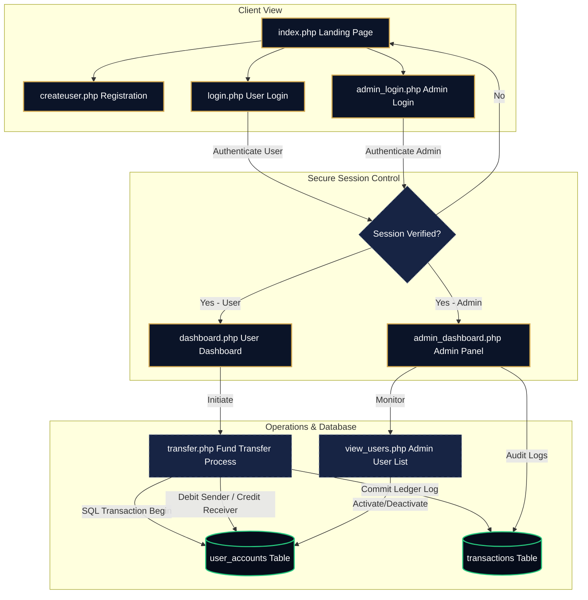

<div align="center">


# 🏦 NexaBank

### **Next-Generation Dark Luxury Banking Management System**

*A secure, premium, and sophisticated online banking experience styled with an editorial financial design system, powered by an optimized PHP/MySQL relational database backend.*

---

[](#)
[](#)
[](#)
[](#)
[](#)

</div>

---

## 🎨 Visual Identity & Aesthetic

NexaBank breaks away from typical bright corporate banking interfaces, introducing a **Dark Luxury Financial** theme designed to feel premium, exclusive, and editorial.

*   **Deep Navy Canvas:** `#060c1a` to `#172444` gradients provide a high-contrast, distraction-free environment.
*   **Gold Accents:** `#d4aa52` represents luxury, wealth, and sophisticated action elements.
*   **Slate Typography:** `#e8edf8` body copy and `#8892aa` secondary titles maintain optimal readability.
*   **High-End Typography:** Uses the elegant **Playfair Display** for serif headers, **DM Sans** for responsive body content, and **JetBrains Mono** for numerical values and transaction references.

---

## ⚡ Core Highlights & Features

### 👤 User Capabilities
*   **Dynamic Client Dashboard:** Instant visual summary of account balance, real-time monthly stats (incoming/outgoing logs), and account details.
*   **Secure Instant Transfers:** Transfer money instantly to any other user via account numbers and IFSC validation.
*   **Transaction Statements Ledger:** Personal history of all incoming and outgoing funds with custom search and transaction notes.
*   **Self-Service Account Creation:** Users can register accounts, set initial deposits, and automatically generate a unique `14-digit` account number.

### 👑 Administrator Capabilities
*   **Consolidated Admin Dashboard:** Overview of total volume, active users, today’s activity, and average transaction values.
*   **Client Management Ledger:** List of all registered users with real-time balance lookup and account activity indicators.
*   **Account Controls:** Power to instantly activate/deactivate accounts to freeze suspicious actions.
*   **Complete Transaction Surveillance:** Centralized ledger showing all system-wide transfers with real-time searches.

---

## 🏗️ System Architecture

The following diagram illustrates how requests flow through the NexaBank secure system:



---

## 🔒 Security Architectures

NexaBank is built with robust mechanisms to safeguard client information and financial assets:

1.  **SQL Injection Prevention:** 100% of custom database interactions use PHP Object-Oriented `mysqli::prepare()` statements and parameter binding (`bind_param`). No raw input concatenation.
2.  **Password Cryptography:** Secure account registration and login verify credentials using state-of-the-art **BCrypt hashing** (`password_hash` with `PASSWORD_DEFAULT`).
3.  **XSS Protection:** Output sanitization helper function `e()` escapes user-provided values globally using `htmlspecialchars` and UTF-8 encoding.
4.  **Transactional Rollbacks:** Fund transfers utilize ACID compliance transactions (`mysqli_begin_transaction`, `mysqli_commit`, `mysqli_rollback`). If either the debit or credit step fails, the entire transaction rolls back to prevent money leakage.

---

## 📊 Database Schema

The database consists of three relational tables optimized with appropriate primary/foreign keys and delete cascades.

### 1. `admin_accounts`
Stores administrative staff profiles authorized to configure and run the bank backend.
| Column | Data Type | Key Type | Purpose |
| :--- | :--- | :--- | :--- |
| `id` | INT | PRIMARY KEY | Auto-incrementing identifier |
| `username` | VARCHAR(100) | - | Administrator displaying name |
| `email` | VARCHAR(150) | UNIQUE | Authentication email |
| `password` | VARCHAR(255) | - | BCrypt hashed password |
| `created_at` | TIMESTAMP | - | Date/time of record creation |

### 2. `user_accounts`
Maintains user records, financial balances, account identification details, and status.
| Column | Data Type | Key Type | Purpose |
| :--- | :--- | :--- | :--- |
| `id` | INT | PRIMARY KEY | Auto-incrementing identifier |
| `name` | VARCHAR(150) | - | Account owner full name |
| `email` | VARCHAR(150) | UNIQUE | Contact and login email address |
| `phone` | VARCHAR(20) | - | Contact phone number |
| `address` | TEXT | - | Physical address |
| `gender` | ENUM | - | Male, Female, or Other |
| `dob` | DATE | - | Owner date of birth |
| `password` | VARCHAR(255) | - | BCrypt hashed password |
| `account_number` | VARCHAR(20) | UNIQUE | Generated 14-digit number |
| `ifsc` | VARCHAR(20) | - | Branch routing identifier (Default: `NEXA0001`) |
| `balance` | DECIMAL(15,2) | - | Active ledger balance (Default: `0.00`) |
| `is_active` | TINYINT(1) | - | Status flag (`1` = Active, `0` = Frozen) |
| `created_at` | TIMESTAMP | - | Registration date |

### 3. `transactions`
Log ledger documenting transfers between accounts.
| Column | Data Type | Key Type | Purpose |
| :--- | :--- | :--- | :--- |
| `id` | INT | PRIMARY KEY | Auto-incrementing identifier |
| `sender_id` | INT | FOREIGN KEY | References `user_accounts(id)` on delete cascade |
| `receiver_id` | INT | FOREIGN KEY | References `user_accounts(id)` on delete cascade |
| `amount` | DECIMAL(15,2) | - | Money transfer volume |
| `note` | VARCHAR(255) | - | Transaction remarks |
| `status` | ENUM | - | Success, Failed, or Pending |
| `date_time` | TIMESTAMP | - | Transfer timestamp |

---

## 🛠️ Installation & Setup

Follow these simple steps to host NexaBank on your local development environment:

### Prerequisites
*   **PHP** version 8.0 or higher.
*   **MySQL** Database / MariaDB.
*   **Apache Server** (e.g. XAMPP, WAMP, or Laragon).

### Setup Steps
1.  **Clone / Copy Project Files:**
    Place the project folder (`nexabank`) inside your local server directory:
    *   **XAMPP:** `C:\xampp\htdocs\nexabank`
    *   **WAMP:** `C:\wamp64\www\nexabank`
    
2.  **Initialize Database:**
    *   Open your web browser and navigate to `http://localhost/phpmyadmin/`.
    *   Create a new database named `nexabank`.
    *   Click on **Import** in the database tab, select the `nexabank.sql` file from the project root, and click **Go**.
    
3.  **Configure Environment Parameters:**
    Open `config.php` and verify the database connection configuration:
    ```php
    define('DB_HOST', 'localhost');
    define('DB_USER', 'root');      // Your MySQL username
    define('DB_PASS', '');          // Your MySQL password
    define('DB_NAME', 'nexabank');  // Your database name
    ```
    
4.  **Run Application:**
    Navigate to `http://localhost/nexabank` in your browser.

---

## 🔑 Test Credentials

Use the following seed credentials to explore user and admin dashboards immediately:

### 👤 User Portals
All users share the default password: `password123`
*   **Arjun Sharma:** `arjun@example.com`
*   **Priya Patel:** `priya@example.com`
*   **Rahul Verma:** `rahul@example.com`
*   **Sneha Reddy:** `sneha@example.com`

### 👑 Administrator Portal
*   **Super Admin:** `admin@nexabank.com`
*   **Password:** `admin123`

---

## 📂 Directory Layout

```bash
nexabank/
├── assets/                  # Project assets (branding & graphics)
│   └── banner.png
├── css/                     # Styling styles sheets
│   └── style.css            # Dark luxury visual system
├── config.php               # Database configuration and global helpers
├── index.php                # Public landing page
├── login.php                # User portal login
├── logout.php               # User session destroy
├── createuser.php           # Shared registration (User signup / Admin direct create)
├── dashboard.php            # Active user interface
├── transfer.php             # Secure transaction terminal
├── transaction_history.php  # Personal account ledger
├── profile.php              # Personal settings editor
├── services.php             # Informational overview
├── admin_login.php          # Admin portal verification
├── admin_dashboard.php      # Main administration hub
├── admin_logout.php         # Admin session destroy
├── view_users.php           # User records management
├── view_transactions.php    # Complete bank transaction ledger
├── navbar.php               # Dynamic header layout component
├── footer.php               # Core brand footer component
└── nexabank.sql             # Relational database setup logic
```

---

<div align="center">
  <p>Designed with ❤️ for premium banking experience.</p>
</div>
